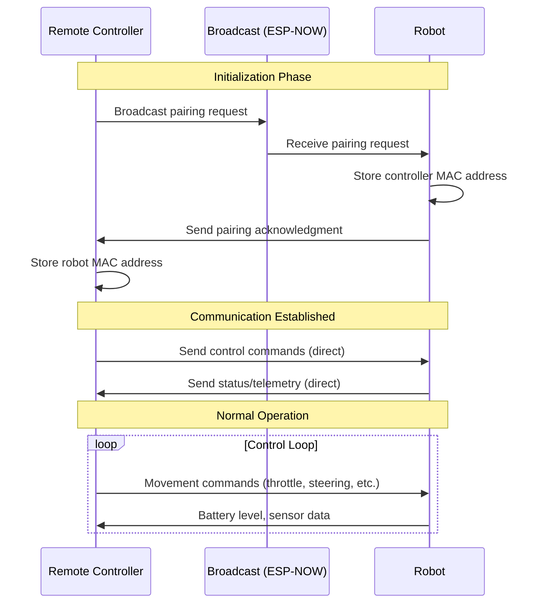

# Rusty Car Project

A side project for building a wireless-controlled robot coded in Rust.

## Overview

This project consists of two main components:
- **Robot**: The autonomous vehicle that receives commands and executes movements
- **Remote Controller**: A wireless controller for sending commands to the robot

Both components are built using **ESP32 microcontrollers** and communicate via **ESP-NOW**, a connectionless communication protocol that provides fast and low-power wireless communication.

## Technology Stack

- **Language**: Rust
- **Hardware**: ESP32 microcontrollers
- **Communication Protocol**: ESP-NOW

## Project Structure

```
rusty-car-project/
├── robot/           # Robot firmware and control code
├── remote-controller/  # Wireless controller firmware
└── README.md
```

## Communication Flow

The controller and robot establish communication using ESP-NOW's broadcast capabilities:



## Getting Started

### Prerequisites

- Rust toolchain installed
- ESP32 development environment configured
- Two ESP32 boards (one for the robot, one for the controller)

### Building and Flashing

The project includes a Makefile with convenient commands:

```bash
# Flash the robot firmware
make robot

# Flash the remote controller firmware
make remote-controller

# Flash both components
make all

# Check code without flashing
make check

# Clean build artifacts
make clean
```

### Quick Start

1. Connect the first ESP32 board (for the robot)
2. Run `make robot` to build and flash the robot firmware
3. Connect the second ESP32 board (for the controller)
4. Run `make remote-controller` to build and flash the controller firmware
5. Power on both devices - they will automatically pair via ESP-NOW broadcast

## Features

(Coming soon)

## License

(Coming soon)
